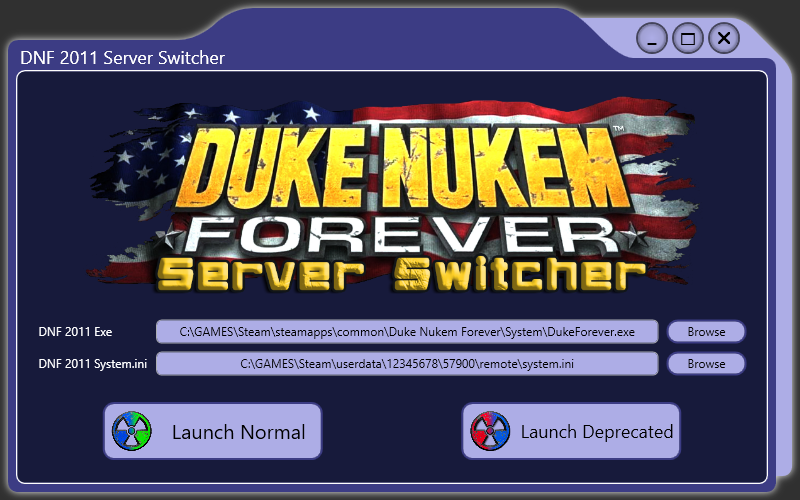
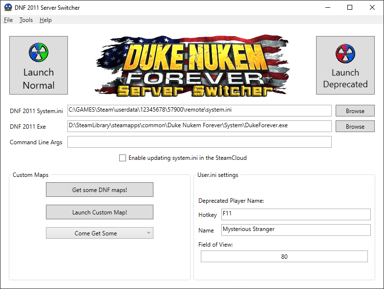

# DnfServerSwitcher
A simple .NET Framework application for switching server modes in Duke Nukem Forever 2011.

Big thanks to Star Nukem for actually starting this project and providing the graphics!

For intense Duke Nukem Forever multiplayer action, join us here: https://steamcommunity.com/groups/dnftournaments

## Warning - Known issue

Sometimes the steam cloud seems to mess with the system.ini file and causes the "Launch Deprecated" mode not to work...
Currently looking into the issue. As a temporary work around, try disabling the steam cloud for Duke Nukem Forever.

## How it works
Upon launching the first time, the application will attempt to auto locate the DukeForever.exe file and the system.ini file.
If auto-detection fails, you can manually set the paths using the browse buttons.

Click Launch Normal to select the normal servers and play multiplayer normally.

Click Launch Derpecated to select the deprecated server mode and play multiplayer on custom servers.

When launching the game, the application configures the server settings in system.ini according to which mode you launch. 

Additionally, when launching in Deprecated mode, the dnWindow.u mod file required for Deprecated mode to work will be copied over into Duke Nukem Forever's system folder. 

NOTE: The application will copy the dnWindow.u file from the "ThirdParty" subfolder. Before launching Deprecated mode, if the file already exists, the dnWindow.u file checksum will be verified and the file will be replaced if different. If you want to use a different dnWindow.u file, replace the one in the "ThirdParty" subfolder!

## Old Theme

I added a cool new theme, but if you don't like it and want the borring Default look, edit this line from the configuration ini:
`ThemeName=DookieNookie2001` change it into `ThemeName=Default`

