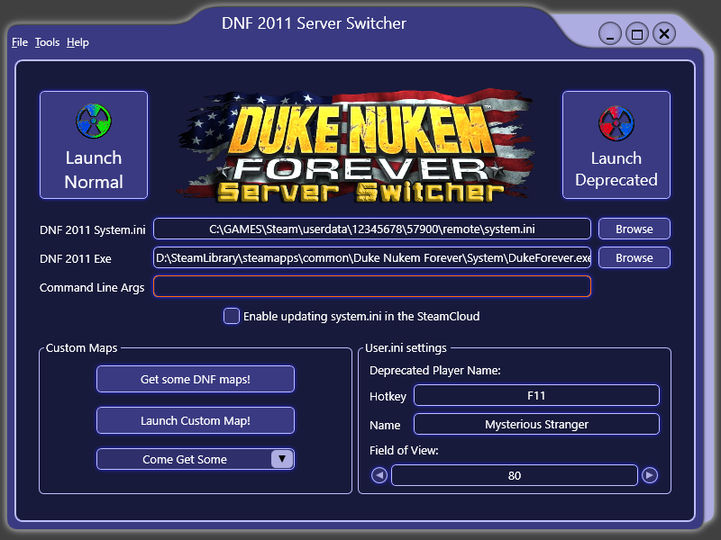

# DnfServerSwitcher
A simple .NET Framework application for switching server modes in Duke Nukem Forever 2011.

Big thanks to Star Nukem for actually starting this project and providing the graphics!

For intense Duke Nukem Forever multiplayer action, join us here: https://steamcommunity.com/groups/dnftournaments

Note: for changes see the [changelog](changelog.txt) file

## Description

### Launching the Game
Upon launching the first time, the application will attempt to auto locate the DukeForever.exe file and the system.ini file.
If auto-detection fails, you can manually set the paths using the browse buttons.

Click Launch Normal to select the normal servers and play multiplayer normally.

Click Launch Derpecated to select the deprecated server mode and play multiplayer on custom servers.

When launching the game, the application configures the server settings in system.ini according to which mode you launch. 

Additionally, when launching in Deprecated mode, the dnWindow.u mod file required for Deprecated mode to work will be copied over into Duke Nukem Forever's system folder. 

NOTE: The application will copy the dnWindow.u file from the "ThirdParty" subfolder. Before launching Deprecated mode, if the file already exists, the dnWindow.u file checksum will be verified and the file will be replaced if different. If you want to use a different dnWindow.u file, replace the one in the "ThirdParty" subfolder!

The `Command Line Args` field can be used to specify additional parameters when launching the game...

### Setting the deprecated player name
The Deprecated mode unfortunately does not remember your set player name. To set your name when joining a game, you have to set a special key binding in the DNF user.ini file, under the `Engine.Input` section. The keybinding looks like this: `<KEY>=name <Player Name>`. So if you want to name yourself `John Player` and use the `F8` key to set the name in game, you have to set the following command in the `Engine.Input` section: `F8=name John Player` - afterwards, when you hit F8 in a deprecated multiplayer game, your name will be set.

Of course, the application does this for you, so all you have to do is select your name and hotkey you want to use in the application interface. Additionally for convenience, you can also adjust your FOV here.

### Launching custom singleplayer maps

The `Get some DNF maps` button opens [https://dnfmaps.com/dnf-2011/](https://dnfmaps.com/dnf-2011/) in a browser. You can download custom maps here for both singleplayer and multiplayer.

The `Launch Custom Map` button lets you select a custom map file, then launches the game using that map file as a command line argument, letting you immediately play the map in singleplayer mode!

### Themes
You can select a different theme color using the `Tools -> Select next theme` menu command or the F8 hotkey.

You can also add additional theme color definitions to the application's Themes subfolder. For more info, see the [DukNuk project page](https://github.com/drone1400/DukNuk)

You can also switch theme mode on and off using the `Tools -> Toggle theme on/off` menu command or the F7 hotkey. This makes the application have the default WPF look.

### Troubleshooting
Sometimes the Steam Cloud sync can get in the way by overwriting the local modified system.ini file with an older version from the cloud. To deal with this you have two options:
1. Tick the checkbox to `Enable uploading the system.ini in the Steam Cloud` - this uses [Facepunch.Steamworks](https://github.com/Facepunch/Facepunch.Steamworks) to send the modified system.ini file to the Steam Cloud
2. Alternatively, you can try the `Delete remotecache.vdf file` command from the tools menu to delete the local cache file and hopefully have the Steam Cloud sync work properly

IMPORTANT NOTE: For the app to sync the `system.ini` file into the cloud, Steam needs to be already running. Otherwise this won't work.
